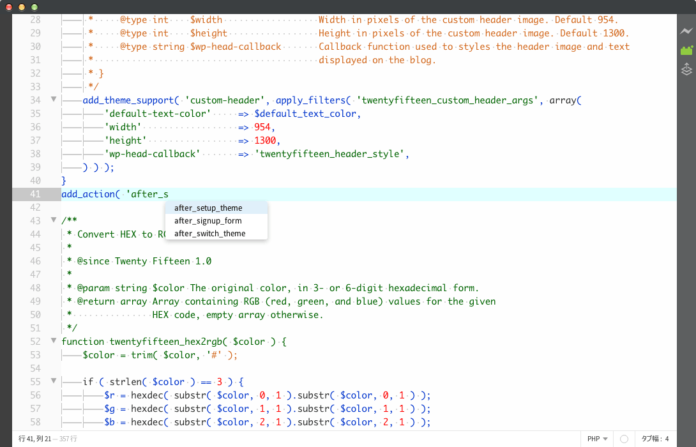

brackets-wp-hooks-hints
===========================

Brackets WordPress Hooks Hints - Provides code hints for hook for the WordPress Themes and/or Plugins.

Screenshot
----------

How to Install
--------------
1.	Open `File` > `Extension Manager`.
2.	Select `Available` Tab.
3.	Search for `Brackets WordPress Hooks Hints`.
4.	Install.

OR

Clone this repository in your extensions directory.

Reference
--------------
WordPress Code Reference / [Hooks](https://developer.wordpress.org/reference/hooks/)

Changelog
--------------
Ver 1.0.2
* Add a new hooks of WordPress 4.3

Ver 1.0.1
* Add a new hooks of WordPress 4.2

Ver 1.0.0
* Initial release.
* Add hooks of up to WordPress 4.1
* Remove hooks of deprecated

License
--------------
Released under the [MIT License](LICENSE).

Copyright
--------------
Copyright (c) 2015 [Mignon Style](http://mignonstyle.com/).